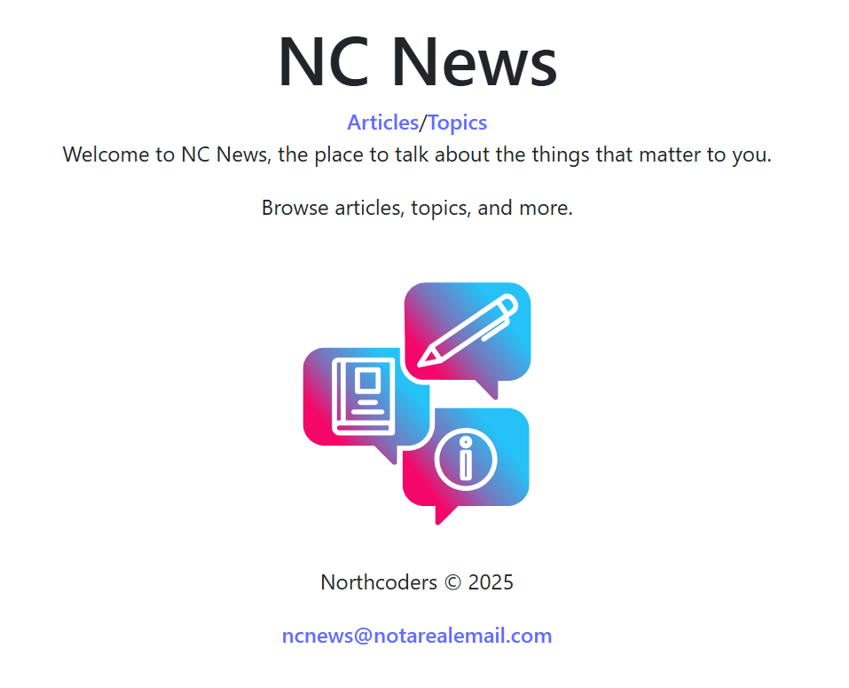
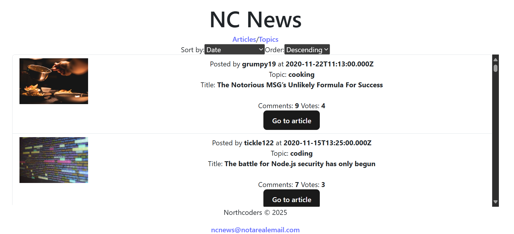
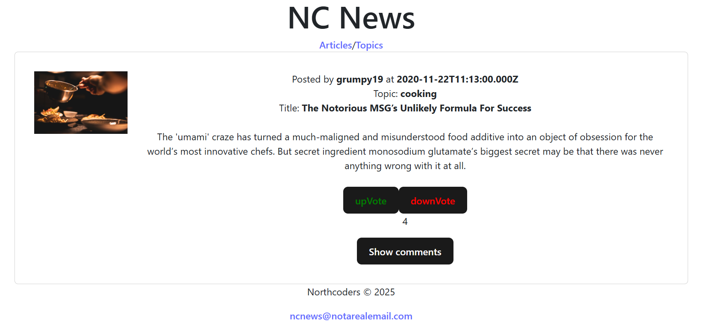
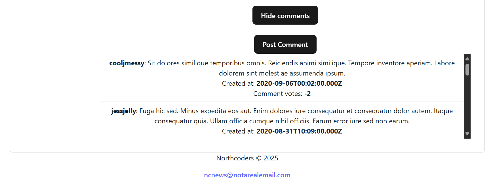
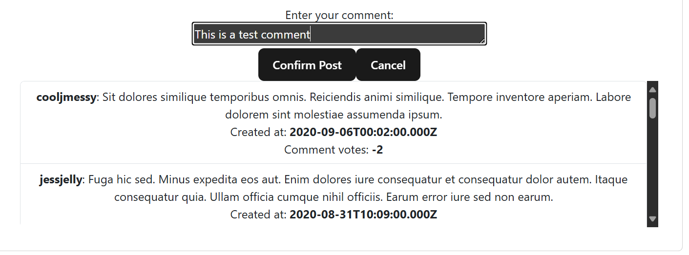
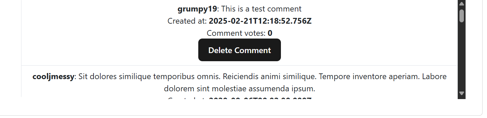
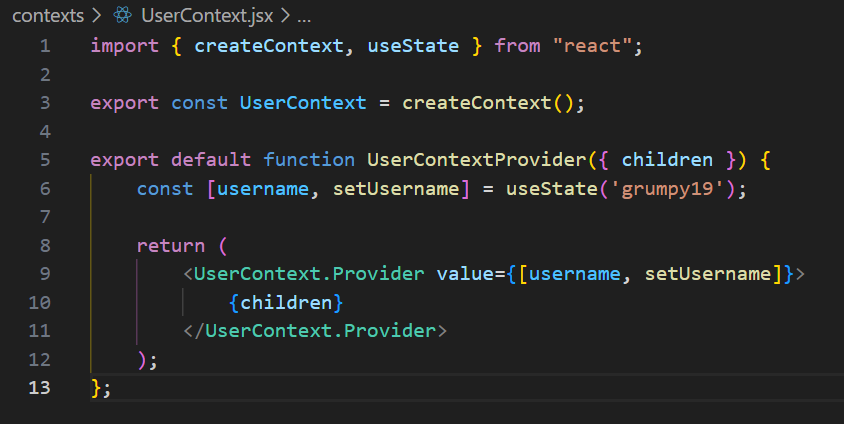

# NC NEWS

## Table of Contents
1. [Project Description](#project-description)
2. [How to Install and Run the Project](#how-to-install-and-run-the-project)
3. [Minimum Version Requirements](#minimum-version-requirements)
4. [How to Use the Project](#how-to-use-the-project)
5. [Deployed Application](#deployed-application)
6. [Credits](#credits)

## Project Description
### Introduction
NC News is a dynamic front-end project crafted with React.js, created as part of a full-stack web application during a JavaScript bootcamp. This project highlights the breadth of skills and knowledge gained throughout the boot-camp, including user interface development, state management, and seamless back-end integration. To explore the backend aspect of this project, check out the repository [be-nc-news](https://github.com/JohnPflug/be-nc-news)

### Features
The application allows users to view, comment on, and vote for articles. It includes features such as user authentication, real-time updates, and a responsive design.

### Technologies Used
Built using React.js, React Bootstrap, Bootstrap, and Axios for the front-end, with Vite as the build tool.

### Challenges and Learning
One of the challenges was handling state management efficiently. React’s Context API was used to manage user information.

### Future Features
Upcoming updates will introduce functionality for uploading articles and implementing pagination for easier navigation through articles.

## How to Install and Run the Project

1. Clone the repository:
```
git clone https://github.com/JohnPflug/fe-nc-news.git
```

2. Navigate into the project directory:
```
cd fe-nc-news
```

3. Install dependencies:
```
npm install
```

4. Run the project:
```
npm run dev
```

## Minimum Version Requirements

| Software                | Version   |
|-------------------------|-----------|
| Node.js                 | v23.2.0   |
| axios                   | ^1.7.9    |
| bootstrap               | ^5.3.3    |
| react-bootstrap         | ^2.10.9   |
| react-router            | ^7.1.5    |
| react-dom               | ^19.0.0   |
| vite                    | ^6.1.0    |

## How to Use the Project
### Overview
Users can browse, read, comment on, and vote for articles across various topics.

| Feature             | Description                                                                  |
|---------------------|------------------------------------------------------------------------------|
| Browse articles     | Users can read articles posted by other users. Users can browse by topic.    |
| Sort articles       | Users can sort articles by date uploaded, comment count                      |
| Vote on articles    | Users can UpVote or DownVote articles that they like or dislike, respectively|
| Comment on articles | Users can comment on articles that they like or dislike, respectively        |
| Delete comments     | Users can delete their own comments, should they wish.                       |

### User Guide
 **Navigating the Interface**
   - **Landing Page**: From the landing page, click the Articles link in the Navigation bar to browse articles or the Topics link to browse topics.
   

   - **Articles Page**: View a list of articles, which can be sorted by Date uploaded, comment count, or vote count,in either ascending or descending order.
   

   - **Article Page**: Clicking the 'Go to article' button takes the user to the article page, where they can see the upVote and downVote the article:
   
   
   - **Comments Section**: Clicking the 'Show comments' button shows the comments for the article:
   

**Performing Specific Actions**:
   - **Post Comments**: Clicking the 'Post Comment' button lets the user post a comment on the article, provided the user is signed into the application. Enter the comment text, then click the 'Confirm Post' button.
   

   - **Delete Comment**: Clicking the 'Delete Comment' button lets the user delete a comment they have already posted, provided they are signed into their account.
   

**Special Functionality**:
   - **User Authentication**: In order to post comments or delete one's own comments, a user needs to be signed into the application. 'grumpy19' is passed as the username state on line 6 of contexts/UserContext.jsx and is used as a React Context value.

   

   If this string is removed (useState()) or replaced with a non-existent username, the user will be able to read the articles but not vote on them. Moreover, while they will be able to read the comments on each article, they will not be able to post comments, nor delete their own.

## Deployed Application
Check out the live version of the application hosted on Netlify:
[NC News](https://jpt-nc-news.netlify.app/)

## Credits
This portfolio project was created as part of a Digital Skills Boot-camp in Software Engineering provided by [Northcoders](https://northcoders.com/)

### Image Credits
- [Education Vectors by Vecteezy](https://www.vecteezy.com/free-vector/education)
- [Bubble Vectors by Vecteezy](https://www.vecteezy.com/free-vector/bubble)
- [Website Vectors by Vecteezy](https://www.vecteezy.com/free-vector/website)
- Spinner SVG by [Loading.io](https://loading.io/)

---
I hope you find this README helpful! If you have any other questions or need further assistance, please contact me at MessageDevQuest@outlook.com